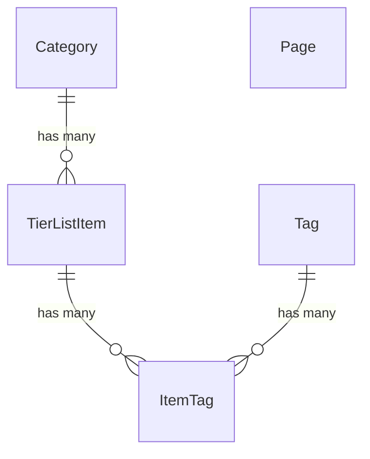

# Domain Model

> **Source of truth:** the Drizzle schema in [`src/lib/server/db/schema.ts`](src/lib/server/db/schema.ts) and the tier logic in [`src/lib/tier.ts`](src/lib/tier.ts).
> If this document conflicts with those files, the code wins.

For the reasoning behind key decisions, see [ADR-0004](docs/decisions/0004-domain-model.md).

## Entities

- **Category** — groups tier list items under a topic (e.g. _Games_, _Books_, _Movies_).
  Has a slug, name, optional description, display order, and optional per-category tier cutoff overrides.
- **TierListItem** — a rated item within a category.
  Carries a numeric score that maps to a tier, a display order, and optional Markdown description.
- **Tag** — a shared label (keyed by slug) that can be attached to any item across categories.
  Related to items via an **ItemTag** join table.
- **Page** — a CMS-managed static page (e.g. Home, About).
  Standalone, no relationships to other entities.

All entities carry `createdAt` and `updatedAt` timestamps.

## Tiers and scoring

Tiers are a hardcoded enum: **S → A → B → C → D → E → F**.

Each item's numeric `score` is mapped to a tier using cutoff thresholds.
Categories can override the defaults per-tier; null values fall back to the global defaults defined in `src/lib/tier.ts`.

Default cutoffs: S ≥ 90, A ≥ 75, B ≥ 60, C ≥ 45, D ≥ 30, E ≥ 15, F ≥ 0.

## Relationships

## Ordering

The `order` field on both Category and TierListItem is an explicit integer.
Within a tier list, items are sorted first by tier (S → F), then by `order` within each tier — not by score.
